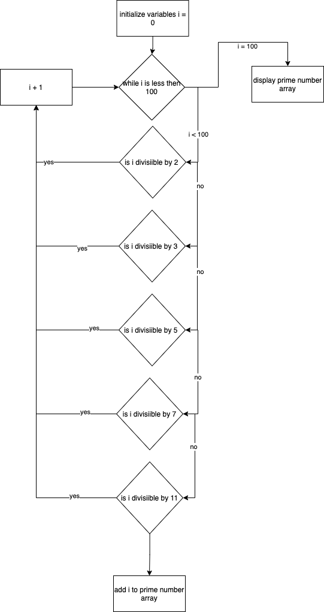

# T1A1_Workbook Assignment

## Qestion 1
Q1	Research the development of the internet from 1980 to today. You must describe at least FIVE key events in the development of the internet. You can refer to events, people of significance, or technologies and how they have changed over time.	300 - 500

>>> Term1 Week1 Activity 4

>>> 1. The development of Arpanet

1.	ARPANET
The Advanced Research Projects Agency Network (ARPANET) which was funded by the US Department of Defence was the first working prototype of the internet started in 1969 and used packet switching so that many computers could communicate on a single network. On 29 October 1969, the first ‘node to node’ communication from a computer based at UCLA was delivered to a computer based at Stanford University. Scientists Robert Kahn and Vinton Cerf developed Transmission Control Protocol and Internet Protocol (TC/IP) in the 1970s, which is a communications model that set the standard on how data could be transmitted between multiple networks. ARPANET adopted TCP/IP on January 1, 1983, and from there researchers began to assemble the “network of networks” that became the modern Internet. ARPANET eventually connected military installations, third-party contractors, and a handful of universities in the US. The online world then took on a more recognizable form in 1990, when computer scientist Tim Berners-Lee invented the World Wide Web. The web is the most common means of accessing data online in the form of websites and hyperlinks. The web helped popularize the internet among the public, and served as a crucial step in developing the vast trove of information. These systems used Interface Message Processors (IMPs), which were computers designed to organize and receive the data coming in and out of the network. Essentially, they were the earliest versions of the modern router. 


>>> 2. Routers/modems

2.	ROUTERS/MODEMS
A modem connects the computer to the internet service provider by taking analogue internet signals and converts it to digital internet signals. The first modem designed to use with a PC was made in 1977. In 1996, the 56k modem became available which allowed internet users to surf the web at 56,000 bits per second. It would take 3.5 days to download a 1GB file on the 56k modem compared to 32 seconds with today’s download speeds. A router is a networking device distributes the digital internet connection to multiple devices usually wirelessly in a local area network (LAN).


>>> 3. emails
3.	EMAIL
Computer-based mail and messaging became possible with the advent of time-sharing computers in the early 1960s, and informal methods of using shared files to pass messages were soon expanded into the first mail systems. Most developers of early mainframes and minicomputers developed similar, but generally incompatible, mail applications. Over time, a complex web of gateways and routing systems linked many of them. Many US universities were part of the ARPANET which aimed at software portability between its systems. In 1971 the first ARPANET network email was sent, introducing the now-familiar address syntax with the '@' symbol designating the user's system address. The Simple Mail Transfer Protocol (SMTP) protocol was introduced in 1981.However, once the final restrictions on carrying commercial traffic over the Internet ended in 1995,[24][25] a combination of factors made the current Internet suite of SMTP, POP3 and IMAP email protocols the standard.


>>> 4. Internet provider companies

4.	INTERNET SERVICE PROVIDER COMPANIES
Internet Service Providers allow subscribers to exchange e-mail and access online services through the Web. Delphi was the first commercial online service in the United States to offer Internet access to its subscribers. Initially many online services were not directly connected to the Internet. These services made available information databases and other relevant material to its subscribers. Eventually online service providers CompuServe, AOL and Prodigy offered full Internet access. In 1991 PSINet, UUNET and CERFnet, (three large computer networks), joined their networks at the Commercial Internet eXchange Association (CIX) for the purpose of commercial ISP interconnection. This encouraged the entry of a number of companies into the market within the United States and eventually the interconnection from these networks to outside the U.S. By 1996, it was estimated that over 2000 commercial ISPs were running within the US alone. As popularity of ISPs grew largely over the last few years, the number of ISPs more than tripled in the United States to over 6500 during 1998 which has remained stable to this day.
Dennis, D (1998) How to become an Internet Access Provider
http://www.amazing.com/internet/ (February 21st, 2000)


>>> 5. phones? (internet in your pocket)

The first hand held mobile phone was designed by a Motorola engineer, Martin Cooper in 1973, the Motorola DynaTEC 8000X (AKA the brick). 
With 1G (First Generation Network) introduced in 1982, mobile telecommunication became commercialized and analogue conversations between mobile phones (mobile/mobile and mobile/landline) were opened. At that time, the mobile manufacturers naturally focused primarily on antenna quality and call quality.

The global consumer market for mobile phones did not really open up until 1992 when the digital mobile network system (Global System for Mobile Communications) introduced the “2G GSM” network technology. 2G made it possible, for text messages (SMS) to be sent and received between mobile phones and SMS became a functionality that accelerated and revolutionised mobile telephony. The GSM system also enabled operators to traffic data, though relatively slowly, over the 2G network. Internet speed was not higher than 0.5 Mbps. In 2001, 3G UMTS (Third Generation Network) arrived, and it became possible to access the Internet from a mobile with a 32 Mbps connection and later with up to 64 Mbps. It was a significant improvement over 2G, which only could provide a maximum speed of up to 0.5 Mbps. With 3G UMTS technology, mobile manufacturers increased their focus on better mobile screens and better representation of colours. The focus was also on the mobile’s data speed and the development of a more comprehensive operating system.

With the introduction of 3G UMTS, the telecommunications companies also got a new revenue leg to stand on. Namely, the phenomenon of mobile broadband. The advantage of Mobile Broadband was that the broadband connection was provided through the telecommunications companies’ mobile networks and cell towers, and which via a router could provide a smaller geographical area, typically a household, with Internet. Mobile broadband subscriptions began to gain market share relatively quickly from the traditional landline-based ADSL providers.With 3G UMTS, the Internet mobile was born, and the mobile rapidly changed Internet usage and habits of the population. The Internet was suddenly at your fingertips, and everything could be Googled, updated and communicated here and now. The unrestricted access to the Internet, like the advent of SMS functionality, which was introduced by the introduction of 2G GSM, had a huge positive impact on the demand for mobile phones in the population.

In 2011, the 4G LTE (Fourth Generation Network) network saw the light of day. With Internet speeds of up to 71 Mbps, 4G LTE provided clear improvements in mobile access to the Internet, and mobile manufacturers were not slow on the uptake when, immediately after launching the 4G network, they launched, by the standard of time, smartphones that were incredibly fast on the Internet. Mobile broadband also got a boost with 4G LTE. When mobile manufacturers really saw that the time for fast processors, large and touch-sensitive screens had arrived.
By 2020, 5G (Fifth Generation Network) mobile telephony and mobile broadband is expected to grow slowly in Europe. With 5G, you can expect Internet speeds 100 times faster than 4G, broadband connections without delays, dedicated bandwidths that ensure exclusive Internet access, for example, traffic services, rescue services and data – machine to machine – (M2M), and extremely fast broadband to other priority and payment areas such as police, intelligence and defence.

With 5G, we talk about the Internet of Things (IoT) and mobile broadband that has been speeded up many times and which is faster and potentially much cheaper than fibre-based Internet.


## Qestion 2
Q2	Define the features of the following technologies that are essential in terms of the development of the internet:

>>> Term1 Week1 Activity 4

>>> packets

>>>IP addresses (IPv4 and IPv6)

>>>routers and routing

>>>domains and DNS

Explain how each technology has contributed to the development of the internet.	50 - 100 words per dot point

## Qestion 3
Q3	Define the features of the following technologies that are essential in terms of the development of the internet:

>>> Term1 Week1 Activity 4

>>>TCP

>>>HTTP and HTTPS

>>>web browsers (requests, rendering and developer tools)

Explain how each technology has contributed to the development of client and server communication over the internet (50 - 150 words for each technology)	150 - 300 words per dot point

## Qestion 4

Arrays are indexed data structure starting from zero , An array is a data structure that contains a group of elements. Typically these elements are all of the same data type, such as an integer or string. Arrays are commonly used in computer programs to organize data so that a related set of values can be easily sorted or searched. Unorganised information of the same type eg books
EG , Colours , Animals 

For example, a search engine may use an array to store Web pages found in a search performed by the user. When displaying the results, the program will output one element of the array at a time. 


Hashes is a function that converts one value to another. Hashing data is a common practice in computer science and is used for several different purposes. Examples include cryptography, compression, checksum generation, and data indexing.

Hashing is a natural fit for cryptography because it masks the original data with another value. A hash function can be used to generate a value that can only be decoded by looking up the value from a hash table. With hashes data is accessed using a key and value pair. This is useful for specific data to stored and retrieved.
EG , Shoe shop and brands of shoes sold


Stacks n computing, a stack is a data structure used to store a collection of objects. Individual items can be added and stored in a stack using a push operation. Objects can be retrieved using a pop operation, which removes an item from the stack.

When an object is added to a stack, it is placed on the top of all previously entered items. When an item is removed, it can either be removed from the top or bottom of the stack. A stack in which items are removed the top is considered a "LIFO" (Last In, First Out) stack.


## Qestion 5
Q5	Describe the features of interpreters and compilers and how they are different.	100 - 200 words on each way code is executed

>>> Interpreters go line by line and change it into machine language

>>> Compilers change the entire document at once

## Qestion 6
Q6	Identify TWO commonly used programming languages and explain the benefits and drawbacks of each.	200 - 400 words on each language

>>> HTML and RUBY ---- Python ----- Javascript
>>> HTML is considered to not be a programming language 

## Qestion 7
Q7	Identify TWO ethical issues from the areas below and discuss the extent to which an IT professional is ethically responsible in terms of the issue.

List of topics containing ethical issues:
 - access to a user’s personal information (medical, family, financial, personal attributes such as sexuality, religion, or beliefs)
 - intellectual property, copyright, and acknowledgement.
 - criminal acts such as theft, fraud, trafficking and distribution of prohibited substances, terrorism
 - GPS tracking data and other types of metadata, MAC addresses, hardware fingerprints
 - freedom of thought, conscience, speech and the media
 - aggressive sales and marketing practices designed to mislead and deceive consumers
 - trading of shares on the stock exchange OR crypto-currencies

For each ethical issue identify a source of legal information relating to the ethical issue and discuss whether the law is helpful in assisting a developer to act in an ethical way. (Word count guide: 200 words max)

Conduct research into a case study of ONE of the ethical issues you have chosen discuss how an ethical IT professional should respond to the case study and how they might mitigate or prevent ethical breaches. (Word count guide: 400 - 600 words)	200 - 400 words for each ethical issue

>>> Pick two ethical issues from above and write 200 words and the ethical responsibilities of an IT worker, and try and link legal documents 2 x 200

>>> For one of them reseach a case study and do an additional 400 words 1 + 400

## Qestion 8

Code normally reads top to bottom , and control flow statements allows you to have forks in the road , so only relevant code is "read" ignoring irrelevant code , making the processing of data more efficient.
Control flow keeps coding dry.

## Qestion 9

get.chomp.to_i is coercion 
Integer(get.chomp) is conversion

Data coercion is attempting to change one data type such as Strings into another data type, such as Integers and if the String isn't an Integer it will still return an Integer('0' in Ruby's case) and not return an error. Type conversion on the other hand will force the data type to change and if it isn't compatible, Ruby will throw an error.

## Qestion 10

A data type is ruby's way of storing and categorizing types of data.

Strings
In Ruby, string is a sequence of one or more characters. It may consist of numbers, letters, or symbols. Here strings are the objects, and apart from other languages, strings are mutable, i.e. strings can be changed in place instead of creating new strings.
name = "Mary"
puts "Hello #{name}"

Integers
In Ruby, Integer class is the basis for the two concrete classes that hold whole numbers. These concrete classes are Bignum and Fixnum. Fixnum holds integer values that are shown in the native machine word, whereas Bignum holds the integer value outside the range of Fixnum
Integer.sqrt(0)        #=> 0
Integer.sqrt(1)        #=> 1
Integer.sqrt(10**400)  #=> 10**200

Float
A floating-point number or a float represents a real number. Real numbers can be either a rational or an irrational number; numbers that contain a fractional part, such as 9.0 or -116.42 . In other words, a float in a Ruby program is a number that contains a decimal point.

Boolean
In Ruby, a boolean refers to a value of either true or false , both of which are defined as their very own data types. ... Every appearance, or instance, of true in a Ruby program is an instance of TrueClass , while every appearance of false is an instance of FalseClass .
%w[ant bear cat].all? { |word| word.length >= 3 } #=> true
[nil, true, 99].all?                              #=> false
[].all?                                           #=> true

## Qestion 11

Q11	Here’s the problem: “There is a restaurant serving a variety of food. The customers want to be able to buy food of their choice. All the staff just quit, how can you build an app to replace them?”

 - Identify the classes(objects/robots) you would use to solve the problem

class/robot : Order taker/Tills

Interacts with Customers, gets their input and checks that the restaurant is capable of dealing with the order. Sends the order to the kitchen as well as takes payment from the customer. This is the face of the restaurant/app and will be in charge of majority og the customer interaction.

class/robot : Head Chef 

Once the order is taken and sent to the kitchen the head chef intercepts it and delegates the jobs to the corresponding chefs. They are in charge of making the kitchen run smoothly as well as making sure the quality of the food is at its highest standard. 

class/robot : Chef

The Chef classes are in charge of cooking the food. Getting the instructions from the head chef and then executing at the best they can. They will cook the food and once ready hand it off to the waiters.

class/robot : Waiter

The waiters are in charge of delivering the food to the customer. Once the food is cooked it and ready it is then brought out to the customer or packaged and sent to their homes. They are the last in line in quality control.

class/robot : Cleaner

This class is in charge of making sure that the kitchen and restaurant stay clean. They will check if there is anything that needs to be cleaned up (kitchen, dishes, toilets etc.) and execute the right course of action to make it so.

## Qestion 12

celsius = gets.chomp.to_i
p celsius
fahrenheit = (celsius * 9 / 5) + 32
print "The result is: "
print fahrenheit
print "."

gets automatically returns a string from the users input, however that strings cannot be used for mathematical equation so we must first convert it into an Integer with to_i. Ruby also automatically tracks the /n at the end of the String, so .chomp must be used before the data coercion to get rid of it.


## Qestion 13

    # inititate variables
    arr = [5,22,29,39,19,51,78,96,84]
    i = 0


    # create a while loop. that loops through all the array indexs until it finds one thats less then the next index
    while (i < arr.size - 1 and arr[i] < arr[i + 1])

        # The code below, increases array index by 1 everytime while makes 1 step 
        i = i + 1 
        
    end

    # Swap the current index with the one above it, and vice versa

    # arr[i] = arr[i +1]
    # arr[i + 1] = arr[i]

    arr[i], arr[i +1] = arr[i + 1], arr[i]

    p arr

## Qestion 14

 1. Create a flowchart to outline the steps for listing all prime numbers between 1 and 100 (inclusive). Your flowchart should make use of standard conventions for flowcharts to indicate processes, tasks, actions, or operations

 


 2. Write pseudocode for the process outlined in your flowchart	N/A

    i = 0
    array_of_prime_numbers = []

    # loop through i until it reach 100
    while i <= 100

        #check if i is divisable by any of these numbers
        if i % 2 == 0 and i != 2
            i += 1
        elsif i % 3 == 0 and i != 3
            i += 1
        elsif i % 5 == 0 and i != 5
            i += 1
        elsif i % 7 == 0 and i != 7
            i += 1
        elsif i % 11 == 0 and i != 11
            i += 1
        else

            #if its not add it to the array
            array_of_prime_numbers.append(i)
            i += 1

        end
    end

    # print out the final array 
    p array_of_prime_numbers

## Qestion 15

```
if raining == true
    if temperature < 15
        #do this 
        puts "It’s wet and cold"
    elsif temperature > 15
        #do this
        puts "It’s warm and raining"
    end
else 
    if temperature < 15
        #do this 
        puts "It’s not raining but cold"
    elsif temperature > 15
        #do this
        puts "It’s warm but not raining"
    end
end
```

## Qestion 16
Q16	ACME Corporation are hiring a new junior developer, as part of their hiring criteria they've created a "coding skill score" based on the specific competencies they require for this role; the more important the skill is for ACME corp, the more points it contributes to the "coding skill score" The skills are weighted as follows:

 - Python (1)
 - Ruby (2)
 - Bash (4)
 - Git (8)
 - HTML (16)
 - TDD (32)
 - CSS (64)
 - JavaScript (128)
​
 Write a program that allows a user to input their skills and then tells them 

 a) Their overall "coding skill score" 

>>> Get input from the user - ask them what skills they know out of the ones above - and then tally up the numbers and display that number on the screen

 b) Skills they may want to learn, and how much each one would improve their score